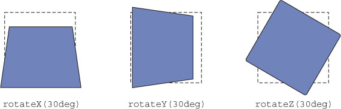
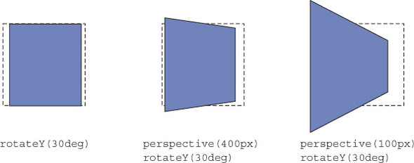

# (3D) transforms

```css
.dimensionOne {
    transform: translate(15px, 50px);
}
.dimensionTwo {
    transform: translateX(15px) translateY(50px);
}
.dimensitonThree {
    transform: translateX(15px) translateY(50px) translateZ(50px);
}
```



---

