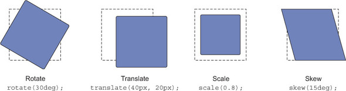

# Rotate, translate, scale ir skew

* Rotate—Spins the element a certain number of degrees around an axis.
* Translate—Moves the element left, right, up, or down (similar to relative positioning).
* Scale—Shrinks or expands the element.
* Skew—Distorts the shape of the element, sliding its top edge in one direction and its bottom edge in the opposite direction.




<style>
    img.chicken {
        max-width: 100%;
    }

    .wrapper {
        background-color: hsl(210, 80%, 20%);
        padding: 30px
    }

    .card {
        padding: 0.5em;
        margin: 0 auto;
        background-color: white;
        max-width: 125px;
        transition: all 1s ease;
    }

    .card--rotate:hover {
        transform: rotate(25deg);
    }

    .card--move:hover {
        transform: translate(150px, 20px);
    }

    .card--scale:hover {
        transform: scale(1.3);
    }

    .card--skew:hover {
        transform: skew(15deg);
    }
</style>

---

```css
rotate {
    transform: rotate(90deg);
}
```

---

<div class="wrapper">
    <div class="card card--rotate">
        
    </div>
</div>

---

```css
move {
    transform: translate(150px, 20px);
}
```

<div class="wrapper">
    <div class="card card--move">
        
    </div>
</div>

---

```css
scale {
    transform: scale(0.8);
}
```

<div class="wrapper">
    <div class="card card--scale">
        
    </div>
</div>

---

```css
skew {
    transform: skew(15deg);
}
```

<div class="wrapper">
    <div class="card card--skew">
        
    </div>
</div>
