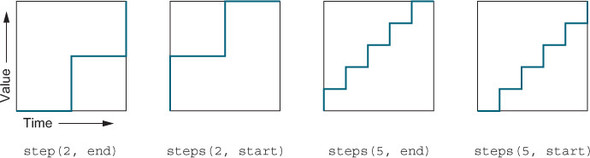

# Steps

One of the timing functions type is *steps()*



<style>
    .container {
        position: relative;
        height: 30px;
    }

    .container:hover .box {
        left: 400px;
    }

    .box {
        position: absolute;
        left: 0;
        height: 30px;
        width: 30px;
        background-color: hsl(130, 50%, 50%);
        border-radius: 5px;
    }

    .box--steps-3 {
        transition: all 1s steps(3);
    }

    .box--steps-5 {
        transition: all 1s steps(5);
    }
</style>

```css
.container {
    position: relative;
    height: 30px;
}

.container:hover .box {
    left: 400px;
}

.box {
    position: absolute;
    left: 0;
    height: 30px;
    width: 30px;
    background-color: hsl(130, 50%, 50%);
    border-radius: 5px;
}
```

<div class="container">
    <div class="box"></div>
</div>

---

Steps 3

<div class="container">
    <div class="box box--steps-3"></div>
</div>

```css
.box--steps-3 {
    transition: all 1s steps(3);
}
```

```html
<div class="container">
    <div class="box box--steps-3"></div>
</div>
```
---

Steps 5

<div class="container">
    <div class="box box--steps-5"></div>
</div>

```css
.box--steps-5 {
    transition: all 1s steps(3);
}
```

```html
<div class="container">
    <div class="box box--steps-5"></div>
</div>
```