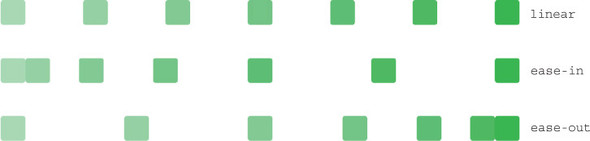
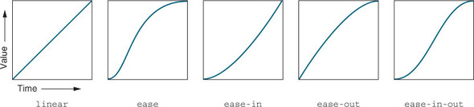

# Timing functions



---



<style>
.container {
    position: relative;
    height: 30px;
}

.container:hover .box {
    left: 400px;
}

.box {
    position: absolute;
    left: 0;
    height: 30px;
    width: 30px;
    background-color: hsl(130, 50%, 50%);
    border-radius: 5px;
}

.box--linear {
    transition: all 2s linear;
}

.box--ease {
    transition: all 2s ease;
}

.box--ease-in {
    transition: all 2s ease-in;
}

.box--ease-out {
    transition: all 2s ease-out;
}

.box--ease-in-out {
    transition: all 2s ease-in-out;
}
</style>

```css
.container {
    position: relative;
    height: 30px;
}

.container:hover .box {
    left: 400px;
}

.box {
    position: absolute;
    left: 0;
    height: 30px;
    width: 30px;
    background-color: hsl(130, 50%, 50%);
    border-radius: 5px;
}
```

```html
<div class="container">
    <div class="box"></div>
</div>
```

---

Linear

<div class="container">
    <div class="box box--linear"></div>
</div>

```css
.box--linear {
    transition: all 2s linear;
}
```

```html
<div class="container">
    <div class="box box--linear"></div>
</div>
```

---

Ease

<div class="container">
    <div class="box box--ease"></div>
</div>

```css
.box--ease {
    transition: all 2s ease;
}
```

```html
<div class="container">
    <div class="box box--ease"></div>
</div>
```

---

Ease in

<div class="container">
    <div class="box box--ease-in"></div>
</div>

```css
.box--ease-in {
    transition: all 2s ease-in;
}
```

```html
<div class="container">
    <div class="box box--ease-in"></div>
</div>
```

---

Ease out

<div class="container">
    <div class="box box--ease-out"></div>
</div>


```css
.box--ease-out {
    transition: all 2s ease-out;
}
```

```html
<div class="container">
    <div class="box box--ease-out"></div>
</div>
```

---

Ease in-out

<div class="container">
    <div class="box box--ease-in-out"></div>
</div>

```css
.box--ease-in-out {
    transition: all 2s ease-in;
}
```

```html
<div class="container">
    <div class="box box--ease-in-out"></div>
</div>
```