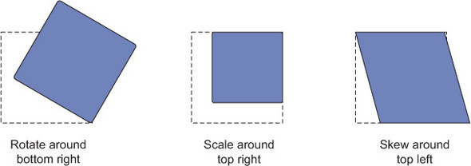

# Transform origin

By default, the point of origin is the center of the element, but you can change this with the transform-origin property.



```css
.right-center {
    transform-origin: right center;
}
```
