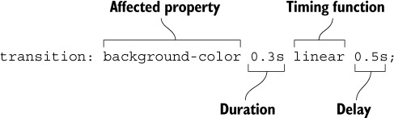

# Transition properties

* `transition-property`
* `transition-duration` 
* `transition-timing-function`
* `transition-delay`

or

* `transition` as shorthand property:

    

P.S.

*Unlike length values, 0 isn’t a valid time. You must include a unit for time values (0s or 0ms) or the declaration will be invalid and ignored by the browser.*
